# T3A2-B Brodey Bright

## Universal Music Hub

### Main Links

Backend repo: https://github.com/Full-Stack-App-Brodey-Bright/Part-B-Server

Frontend repo: https://github.com/Full-Stack-App-Brodey-Bright/Part-B-Front-End

Deployed site: https://universalmusichub.netlify.app

### Documentation Links

Trello Board: https://trello.com/b/8QAbbo6A/universal-music-hub

Production and Development testing spreadsheet: https://docs.google.com/spreadsheets/d/1nc8l3PZ9UFg441Vtz-baZO323kwJ6tXV2D43-hyQthA/edit?usp=sharing

## Important Notes on Using the Website

OAuth will not work unless I specifically add the email being used into the Google API settings page. This is only used for importing playlists from Youtube and is not required to use the app.
If you would like to test the Youtube import functionality you can email me at brodey880@gmail.com with the email you want to connect to the website and I will add it to the API when I can.

## Packages and frameworks used:

#### Backend

- Node.js: Framework for all API server code.
- npm: Used for package installation and management.
- MongoDB: The database. Used with Atlas. It contains 4 collections (Users, Notifications, Playlists and Queues.)
- ExpressJS: Used for API routing, handling all endpoints and logic.
- Bcrypt: Used for hashing passwords .
- Cors: Used to allow Netlify to communicate with the API.
- JsonWebToken: Used to assign and decrypt user tokens as well as tell the backend who is logged in.
- dotenv: Used to hide and save sensitive variables such as Youtube API keys 
- mongoose: Used to create schemas and data structures for the database.
- nodemon: Used to aid in development of the backend

### Frontend

- Vite/React: Used for the frontend of the application. I made a lot of use out of the useState and useEffect hooks.
- npm: Used for package installation and management.
- react-router-dom: Used to manage routing between pages. BrowserRouter Router and Route were used to set change the rendered component based on the url.
- Vitest: Used for some unit testing.
- Js-cookie: Used to store user data across the website such as JWT's and access tokens.
- React Player: Was used to play, pause, skip and mute all of the tracks in the site.
- Rc Slider: Was used to display the duration bar for the track as well as to navigate through the tracks progress when dragging the slider.

# Production and Development Testing Evidence

All production and development testing was done using this spreadsheet:

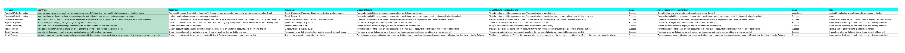

# Project Management

Most recent Trello screenshot:

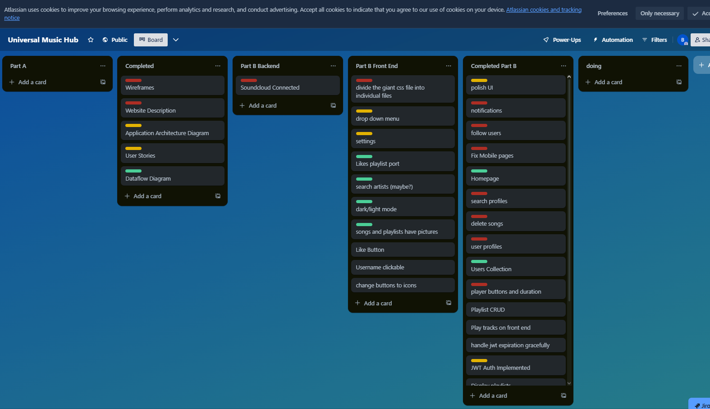

# Screenshots

<p float="left">
   <p>Homepage Before Sign Up </p>
   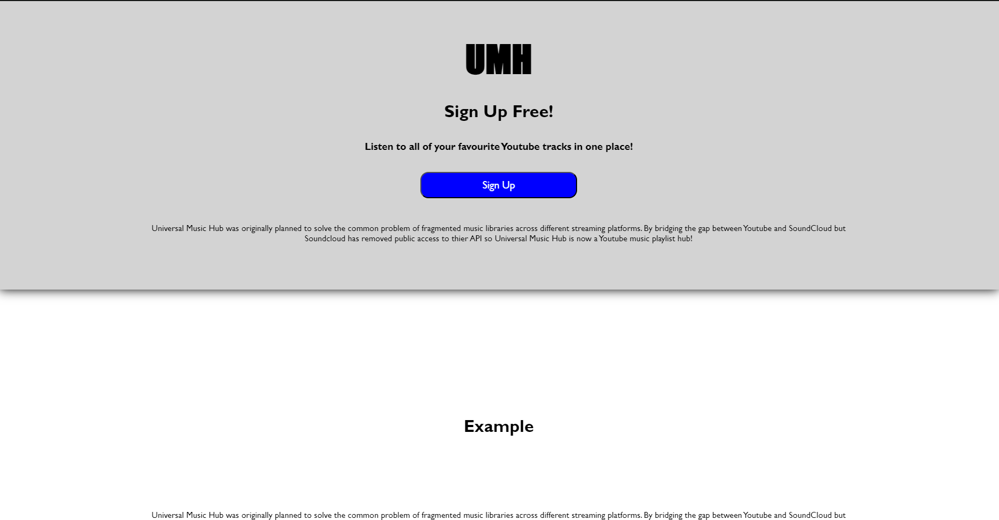
   <p>Sign Up Page</p>
   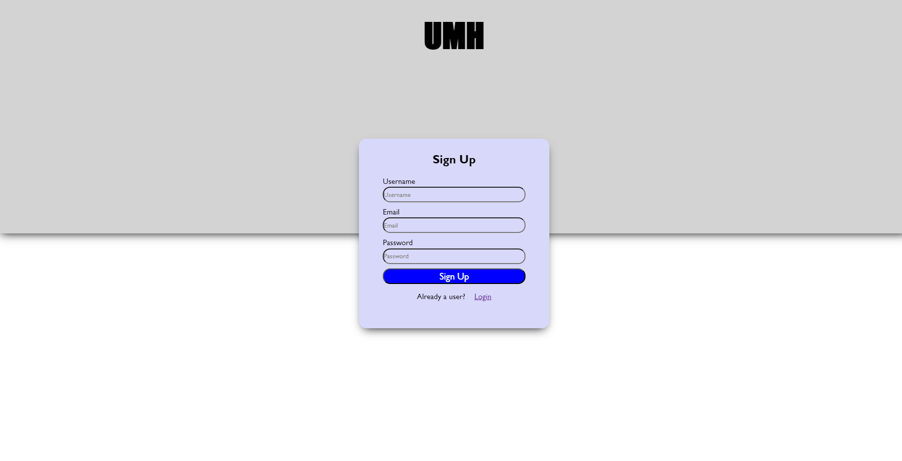
   <p>User Dashboard and Library</p>
   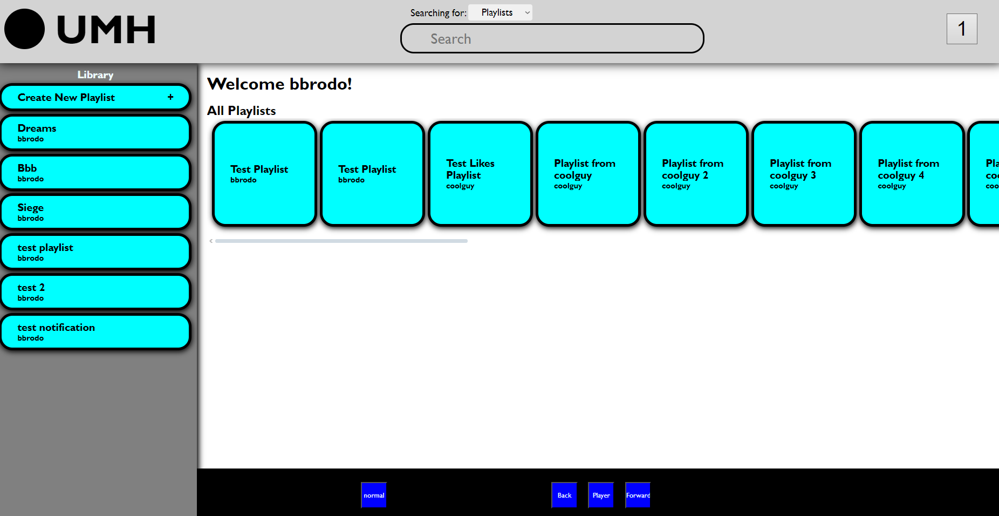
   <p>Search Playlists</p>
   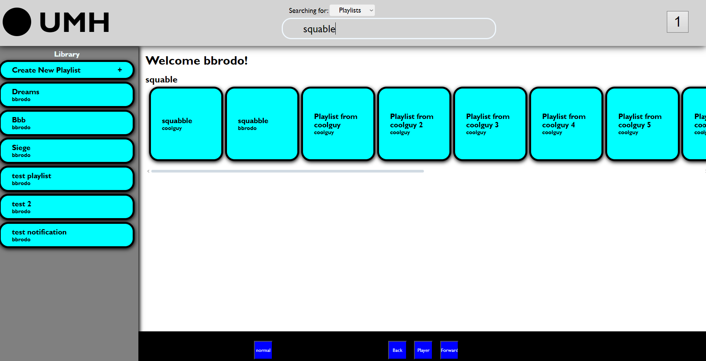
   <p>Search Users</p>
   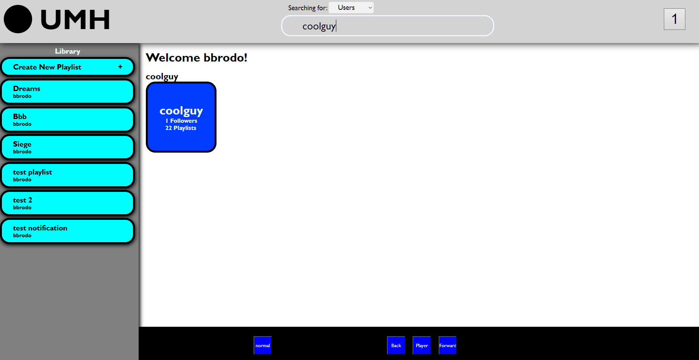
   <p>Search Tracks</p>
   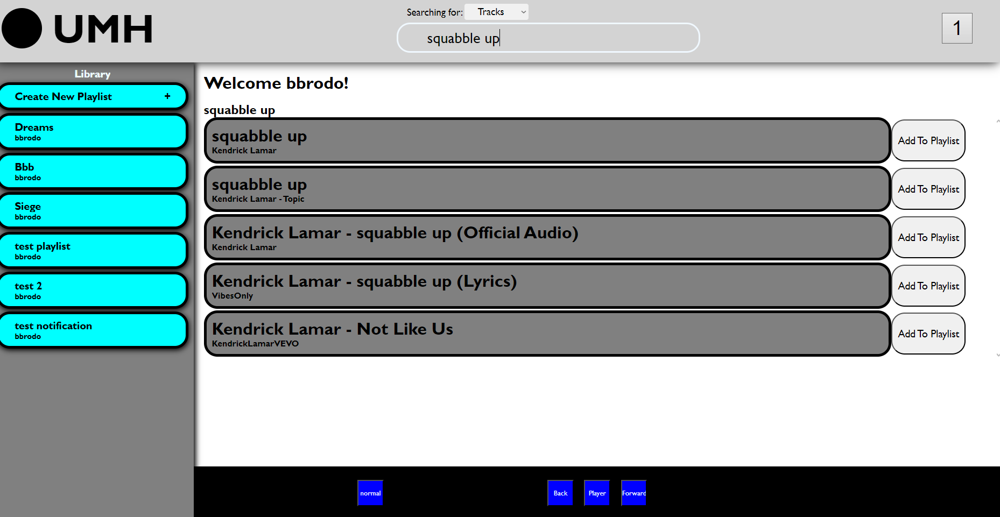
   <p>Playlist Page</p>
   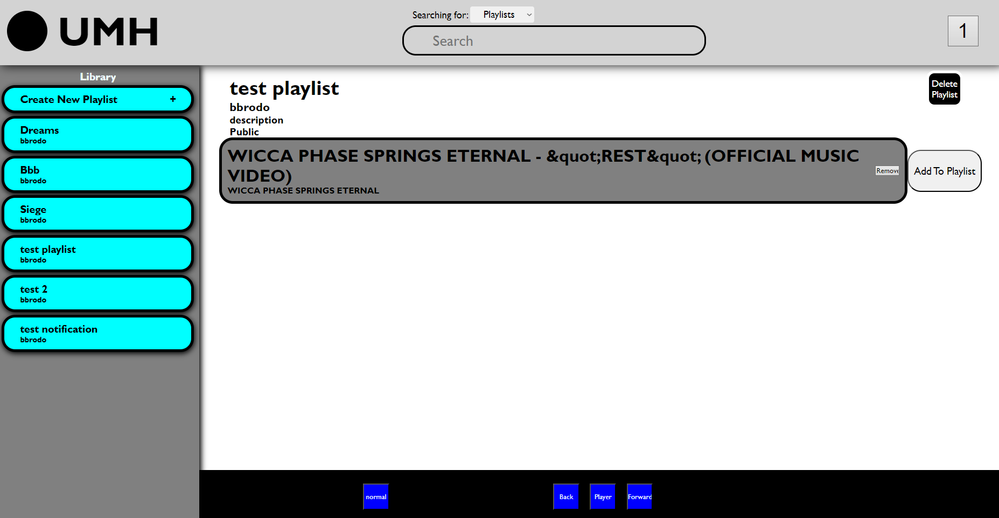
   <p>Notifications Page</p>
   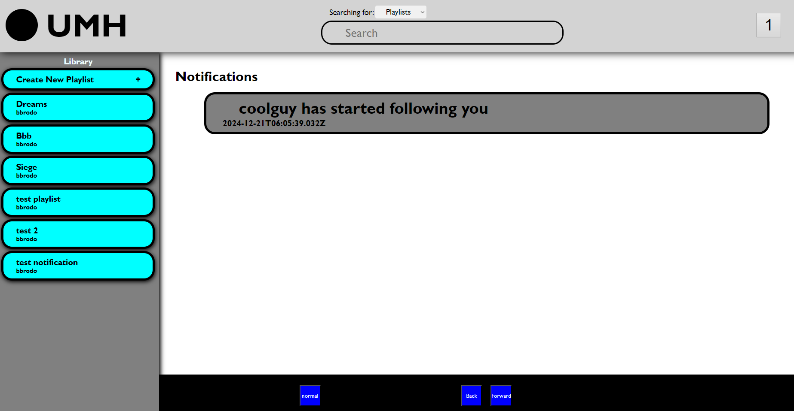
   <p>User Profile Page</p>
   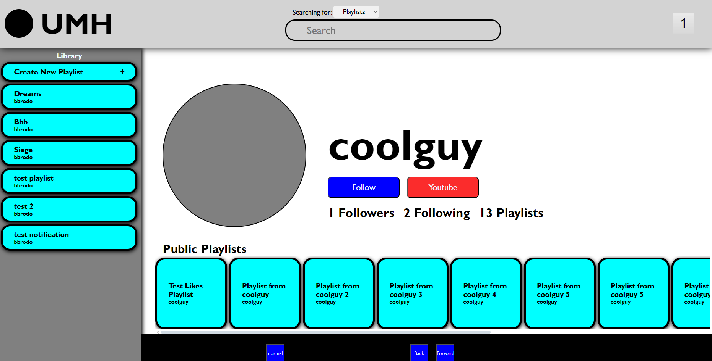
   <p>Creating a Playlist</p>
   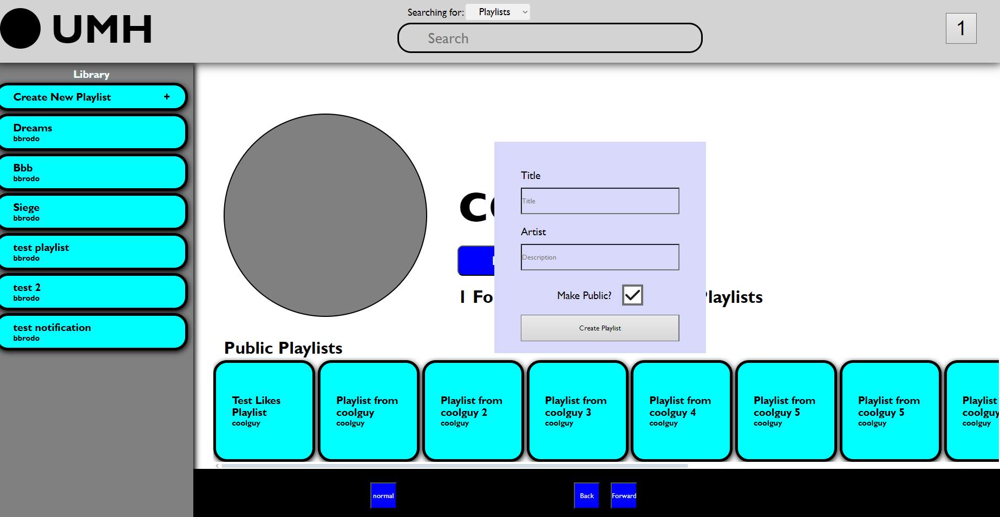
</p>


# Changes to Part A Plan
## Purpose
Universal Music Hub was originally planned to solve the common problem of fragmented music libraries across different streaming platforms. By bridging the gap between Youtube and SoundCloud but Soundcloud has removed public access to their API so Universal Music Hub is now a Youtube music playlist hub! It enables users to:

- Access their Youtube music collection
- Create playlists using tracks from Youtube
- Maintain a consistent listening experience across tracks

## Core Functionality & Features

### 1. Account Integration
- Secure authentication with Youtube accounts
- Automatic playlist import from Youtube
### 2. Playlist Management
- Create playlists
- Import existing playlists from Youtube
- Add and remove tracks
### 3. Playback Controls
- Universal queue system
- Seamless playback switching between tracks
- Shuffle and repeat options

### 4. Search & Discovery
- Search for tracks across Youtube
- Search for public playlists
- Search for users

### 5. User Experience
- Intuitive, modern interface
- Responsive design for all devices
- Real-time updates and notifications

### 6. Social Features
- Follow other users
- Share playlists and tracks

## Target Audience

### Primary Audience
1. Music Enthusiasts
   - Active music listeners who already use Youtube but don't like the UI
   - Playlist creators and curators

2. Content Creators
   - Podcast producers
   - Social media content creators

3. Young Tech-Savvy Users
   - Age range: 16-35
   - Comfortable with technology
   - Active social media users
   - Early adopters of new music platforms

### Secondary Audience
1. Casual Music Listeners
   - Users who occasionally use Youtube for music
   - People who share music with friends

2. Music Industry Professionals
   - Artists and producers
   - Music bloggers and journalists
   - Event organizers

# User Stories

## High Priority Stories

### Authentication & Account Management

**Initial Story:**
As a music listener, I want to connect my Youtube account so that I can access my music using a more suitable UI

**Refined Stories:**
1. As a new user, I want to connect my Youtube account using OAuth so that I can quickly start accessing my Youtube library.
   - Acceptance Criteria:
     - One-click Youtube OAuth connection
     - Clear error messaging if connection fails
     - Successful connection confirmation

2. As a returning user, I want my login sessions to persist so that I don't have to reconnect my account every time.
   - Acceptance Criteria:
     - Secure token storage
     - Clear session expiration handling

### Playlist Management

**Initial Story:**
As a playlist creator, I want to make playlists that contain songs from Youtube so that I can organize my Youtube playlists easier.

**Refined Stories:**
1. As a playlist curator, I want to create a new playlist and add songs from Youtube so that I can organize my music collection.
   - Acceptance Criteria:
     - Create playlist with name and description
     - Add songs from search results

2. As a music enthusiast, I want my existing Youtube playlists to automatically import so that I don't lose my current music organization.
   - Acceptance Criteria:
     - Automatic playlist detection
     - Automatic playlist importation

### Playback Experience

**Initial Story:**
As a listener, I want to play songs seamlessly so that I don't notice the gap in playback.

**Refined Stories:**
1. As an active listener, I want smooth transitions between tracks so that my listening experience isn't interrupted.
   - Acceptance Criteria:
     - Gapless playback

## Medium Priority Stories

### Search & Discovery

**Initial Story:**
As a user, I want to search for songs across Youtube so that I can find all available versions.

**Refined Stories:**
1. As a music discoverer, I want search results from Youtube so that I can compare versions and availability.
   - Acceptance Criteria:
     - Search by track name
     - Sorted by relevance

### Social Features

**Initial Story:**
As a social user, I want to share my playlists with friends so that we can enjoy music together.

**Refined Stories:**
1. As a social music fan, I want to share my playlists so that my friends can access them.
   - Acceptance Criteria:
     - Generate shareable links
     - Privacy controls

2. As a playlist discoverer, I want to browse public playlists so that I can find new music.
   - Acceptance Criteria:
     - Search playlists
     - View playlist contents
     - Add songs from other playlists to your own

## Original Part A Plan: [Part A Plan](docs/README.md)

# API Routes Documentation

# Authentication API Documentation

## Available Routes

### Register User
`POST /api/auth/register`

Creates a new user account with the provided credentials.

#### Request Body
```json
{
    "username": "string",
    "email": "string",
    "password": "string"
}
```

#### Headers
- Content-Type: application/json

#### Input Validation
- Request body is validated using the `validateRegisterInput` middleware
- Checks for existing users with the same email or username

#### Process Flow
1. Validates input using middleware
2. Checks for existing user
3. Hashes password using bcrypt
4. Creates new user in database
5. Generates JWT token
6. Updates user document with JWT token

#### Responses

**Success (201)**
```json
{
    "message": "User registered successfully",
    "username": "string",
    "id": "string",
    "token": "string"
}
```

**Error Cases**
- 400: User already exists
```json
{
    "message": "User with this email or username already exists"
}
```
- 500: Server error
```json
{
    "message": "Server error during registration"
}
```

### Login User
`POST /api/auth/login`

Authenticates an existing user and returns a JWT token.

#### Request Body
```json
{
    "email": "string",
    "password": "string"
}
```

#### Headers
- Content-Type: application/json

#### Process Flow
1. Finds user by email
2. Validates password using bcrypt
3. Deletes old notifications
4. Generates new JWT token
5. Updates user document with new JWT token

#### Responses

**Success (200)**
```json
{
    "message": "Login successful",
    "username": "string",
    "id": "string",
    "token": "string"
}
```

**Error Cases**
- 400: Invalid credentials or user not found
```json
{
    "message": "User Does Not Exist"
}
```
```json
{
    "message": "Invalid credentials"
}
```
- 500: Server error
```json
{
    "message": "Server error during login"
}
```

## Security Features
- Password hashing using bcrypt (10 rounds)
- JWT tokens with 1-hour expiration
- JWT secret stored in environment variables
- Input validation middleware for registration
- Automatic cleanup of old notifications on login

## Dependencies
- express
- bcrypt
- jsonwebtoken
- mongoose (implied by User model)

# User Management API Documentation

## Authentication
All routes require JWT authentication using the `validateJWT` middleware. 
The JWT token must be provided in the Authorization header using the Bearer scheme:
```
Authorization: Bearer <token>
```

## Available Routes

### Get User Profile
`GET api/user/:userId`

Retrieves a user's profile and their public playlists.

#### Path Parameters
- `userId`: The ID of the user to fetch

#### Headers
- Authorization: Bearer token

#### Responses

**Success (200)**
```json
{
    "userDetails": {
        "username": "string",
        "id": "string",
        "followers": ["string"],
        "following": ["string"]
    },
    "playlists": [
        {
            // Public playlist objects
        }
    ]
}
```

**Error Cases**
- 500: Server error
```json
{
    "message": "Error retrieving user",
    "error": "error message"
}
```

### Search Users
`GET /api/user`

Searches for users based on username with fuzzy matching.

#### Query Parameters
- `searchQuery`: Search term for username matching

#### Headers
- Authorization: Bearer token

#### Search Features
- Uses MongoDB Atlas Search with autocomplete
- Fuzzy matching with maximum 2 edits
- No prefix length requirement
- Maximum 50 expansions

#### Responses

**Success (200)**
```json
{
    "users": [
        // Array of matching user objects
    ]
}
```

**Error Cases**
- 500: Server error
```json
{
    "message": "Error retrieving user",
    "error": "error message"
}
```

### Follow/Unfollow User
`POST /api/user/:userId/follow`

Toggles follow status for a user. If already following, unfollows; if not following, follows.

#### Path Parameters
- `userId`: The ID of the user to follow/unfollow

#### Headers
- Authorization: Bearer token

#### Features
- Prevents self-following
- Creates notification for new follows
- Manages bidirectional following relationship
- Toggles follow status automatically

#### Responses

**Success (200)**
```json
{
    "message": "User followed" | "User unfollowed",
    "followerCount": number
}
```

**Error Cases**
- 403: Attempting to follow self
```json
{
    "message": "You cannot follow yourself!"
}
```
- 404: User not found
```json
{
    "message": "User not found"
}
```
- 500: Server error
```json
{
    "message": "Error following user",
    "error": "error message"
}
```

### Get User's Following List
`GET /api/user/:userId/following`

Retrieves list of users that the specified user is following.

#### Path Parameters
- `userId`: The ID of the user whose following list to fetch

#### Headers
- Authorization: Bearer token

#### Responses

**Success (200)**
```json
{
    "username": "string",
    "following": [
        {
            // User objects (excluding password, email, and JWT)
        }
    ]
}
```

**Error Cases**
- 500: Server error
```json
{
    "message": "Error retrieving user following",
    "error": "error message"
}
```

## Security Features
- JWT validation on all routes
- Password and sensitive data exclusion from following queries
- Error handling for invalid tokens
- Protection against self-following

## Dependencies
- express
- mongoose
- JWT validation middleware

# Playlist Management API Documentation

## Authentication
All routes require JWT authentication using the `validateJWT` middleware. 
The JWT token must be provided in the Authorization header using the Bearer scheme:
```
Authorization: Bearer <token>
```

## Available Routes

### Create Playlist
`POST /api/playlists`

Creates a new playlist for the authenticated user.

#### Request Body
```json
{
    "title": "string",
    "description": "string",
    "tracks": ["string"],
    "isPublic": boolean,
    "tags": ["string"],
    "genres": ["string"]
}
```

#### Features
- Automatically assigns creator and username
- Notifies all followers of playlist creation
- Adds playlist to user's playlist collection

#### Responses

**Success (201)**
```json
{
    "message": "Playlist created successfully",
    "playlist": {
        // Created playlist object
    }
}
```

**Error Cases**
- 500: Server error
```json
{
    "message": "Error creating playlist",
    "error": "error message"
}
```

### Get Playlists
`GET /api/playlists`

Retrieves playlists based on various query parameters.

#### Query Parameters
- `page` (default: 1): Page number for pagination
- `limit` (default: 10): Number of items per page
- `searchQuery`: Search term for playlist matching
- `genre`: Filter by genre
- `publicOnly` (default: false): Show only public playlists
- `id`: Fetch specific playlist by ID
- `all` (default: false): Include all accessible playlists

#### Search Features
- Uses MongoDB Atlas Search with fuzzy matching
- Searches across all fields (wildcard path)
- Maximum 2 edits for fuzzy matching
- No prefix length requirement
- Maximum 50 expansions

#### Responses

**Success (200)**
```json
{
    "playlists": [
        // Array of playlist objects
    ],
    "total": number,
    "page": number,
    "totalPages": number
}
```

**Error Cases**
- 500: Server error
```json
{
    "message": "Error retrieving playlists",
    "error": "error message"
}
```

### Update Playlist
`PUT /api/playlists/:playlistId`

Updates an existing playlist.

#### Path Parameters
- `playlistId`: ID of the playlist to update

#### Request Body
```json
{
    "title": "string",
    "description": "string",
    "tracks": ["string"],
    "isPublic": boolean,
    "tags": ["string"],
    "genres": ["string"]
}
```

#### Responses

**Success (200)**
```json
{
    "message": "Playlist updated successfully",
    "playlist": {
        // Updated playlist object
    }
}
```

**Error Cases**
- 404: Playlist not found
```json
{
    "message": "Playlist not found"
}
```
- 500: Server error
```json
{
    "message": "Error updating playlist",
    "error": "error message"
}
```

### Delete Playlist
`DELETE /api/playlists/:playlistId`

Deletes a playlist owned by the authenticated user.

#### Path Parameters
- `playlistId`: ID of the playlist to delete

#### Responses

**Success (200)**
```json
{
    "message": "Playlist deleted successfully",
    "playlist": {
        // Deleted playlist object
    }
}
```

**Error Cases**
- 404: Playlist not found
```json
{
    "message": "Playlist not found"
}
```
- 500: Server error
```json
{
    "message": "Error deleting playlist",
    "error": "error message"
}
```

### Like/Unlike Playlist
`POST /api/playlists/:playlistId/like`

Toggles like status for a playlist.

#### Path Parameters
- `playlistId`: ID of the playlist to like/unlike

#### Features
- Prevents liking private playlists (unless owner)
- Creates notification for playlist creator on new likes
- Toggles like status automatically
- Maintains like count

#### Responses

**Success (200)**
```json
{
    "message": "Playlist liked" | "Playlist unliked",
    "likeCount": number
}
```

**Error Cases**
- 403: Attempting to like private playlist
```json
{
    "message": "Cannot like private playlist"
}
```
- 404: Playlist not found
```json
{
    "message": "Playlist not found"
}
```
- 500: Server error
```json
{
    "message": "Error liking playlist",
    "error": "error message"
}
```

## Security Features
- JWT validation on all routes
- Private playlist protection
- Creator-only playlist deletion
- Error handling for invalid tokens

## Dependencies
- express
- mongoose
- JWT validation middleware

# Notifications API Documentation

## Authentication
All routes require JWT authentication using the `validateJWT` middleware. 
The JWT token must be provided in the Authorization header using the Bearer scheme:
```
Authorization: Bearer <token>
```

## Available Routes

### Get Unread Notifications
`GET /api/notifications`

Retrieves all unread notifications for the authenticated user. Automatically cleans up old notifications before fetching.

#### Headers
- Authorization: Bearer token

#### Features
- Automatically deletes old notifications
- Returns only unread notifications
- Validates user authentication

#### Responses

**Success (200)**
```json
{
    "notifications": [
        // Array of notification objects
    ]
}
```

**Error Cases**
- 500: Server error
```json
{
    "message": "Error retrieving Notifications",
    "error": "error message"
}
```
- Authentication Error
```json
{
    "message": "Error retrieving Notifications",
    "error": "Error token was not provided. Please login first."
}
```

## Security Features
- JWT validation on all routes
- Automatic cleanup of old notifications
- Error handling for invalid tokens
- User-specific notification access

## Dependencies
- express
- mongoose
- JWT validation middleware

# Queue Management API Documentation

## Authentication
All routes require JWT authentication using the `validateJWT` middleware. 
The JWT token must be provided in the Authorization header using the Bearer scheme:
```
Authorization: Bearer <token>
```

## Available Routes

### Create/Update Queue
`POST /api/queue`

Creates a new queue or updates an existing queue with tracks from a specified playlist.

#### Request Body
```json
{
    "playlistId": "string"
}
```

#### Features
- Validates playlist existence and access rights
- Creates new queue if none exists
- Updates existing queue with new tracks
- Handles public/private playlist permissions

#### Responses

**Success (201)**
```json
{
    "message": "Queue created/updated successfully",
    "queue": {
        "currentTrack": "string",
        "tracks": ["string"],
        "playbackState": "string"
    }
}
```

**Error Cases**
- 403: Unauthorized playlist access
```json
{
    "message": "Unauthorized playlist access"
}
```
- 404: Playlist not found
```json
{
    "message": "Playlist not found"
}
```
- 500: Server error
```json
{
    "message": "Error creating queue",
    "error": "error message"
}
```

### Update Playback State
`PATCH /api/queue/state`

Updates the current playback state of the queue.

#### Request Body
```json
{
    "playbackState": "string",
    "progress": number,
    "currentTrack": "string"
}
```

#### Responses

**Success (200)**
```json
{
    "message": "Queue state updated",
    "queue": {
        "playbackState": "string",
        "progress": number,
        "currentTrack": "string"
    }
}
```

**Error Cases**
- 404: No active queue
```json
{
    "message": "No active queue found"
}
```
- 500: Server error
```json
{
    "message": "Error updating queue state",
    "error": "error message"
}
```

### Get Next Track
`GET /api/queue/next`

Retrieves the next track in the queue based on current playback mode.

#### Features
- Supports different playback modes (normal, repeat, repeat_one, shuffle)
- Automatically updates queue position
- Resets progress for new track

#### Responses

**Success (200)**
```json
{
    "message": "Next track retrieved",
    "nextTrack": "string",
    "playbackMode": "string"
}
```

**End of Queue (200)**
```json
{
    "message": "No more tracks in queue",
    "nextTrack": null
}
```

**Error Cases**
- 404: No active queue
```json
{
    "message": "No active queue found"
}
```
- 500: Server error
```json
{
    "message": "Error getting next track",
    "error": "error message"
}
```

### Change Playback Mode
`PATCH /api/queue/mode`

Updates the playback mode of the queue.

#### Request Body
```json
{
    "playbackMode": "string"
}
```

#### Supported Playback Modes
- `normal`: Sequential playback
- `repeat`: Repeat entire queue
- `repeat_one`: Repeat current track
- `shuffle`: Random track order

#### Responses

**Success (200)**
```json
{
    "message": "Playback mode updated",
    "playbackMode": "string"
}
```

**Error Cases**
- 400: Invalid mode
```json
{
    "message": "Invalid playback mode"
}
```
- 404: No active queue
```json
{
    "message": "No active queue found"
}
```
- 500: Server error
```json
{
    "message": "Error updating playback mode",
    "error": "error message"
}
```

## Security Features
- JWT validation on all routes
- Playlist access verification
- User-specific queue management
- Input validation for playback modes

## Dependencies
- express
- mongoose
- JWT validation middleware

# YouTube Authentication API Documentation

## Authentication
All routes require JWT authentication using the `validateJWT` middleware. 
The JWT token must be provided in the Authorization header using the Bearer scheme:
```
Authorization: Bearer <token>
```

## Available Routes

### Store YouTube Authentication
`POST /auth/youtubeauth`

Stores a user's YouTube access token in their profile.

#### Request Body
```json
{
    "accessToken": "string"
}
```

#### Features
- Updates user's YouTube token in database
- Requires JWT authentication
- Single operation token storage

#### Responses

**Success (200)**
```json
{
    "message": "Youtube Connection Success! Storing Keys"
}
```

**Error Cases**
- 401: Invalid JWT token
- 500: Server error

## Security Features
- JWT validation required
- Secure token storage
- User-specific token management

## Dependencies
- express
- bcrypt
- jsonwebtoken
- mongoose
- JWT validation middleware
