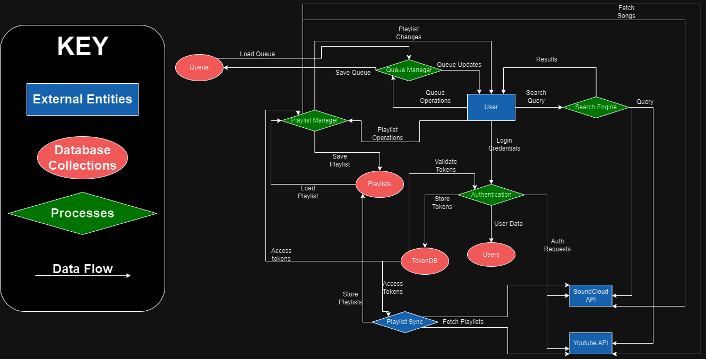
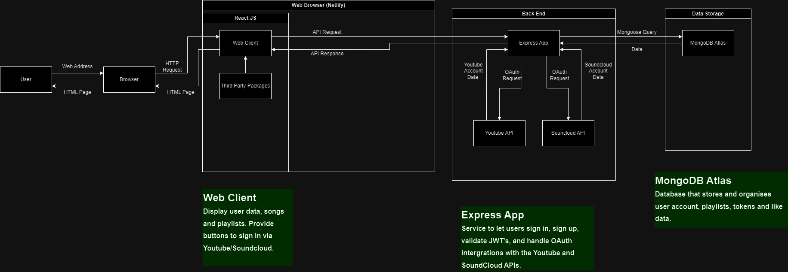
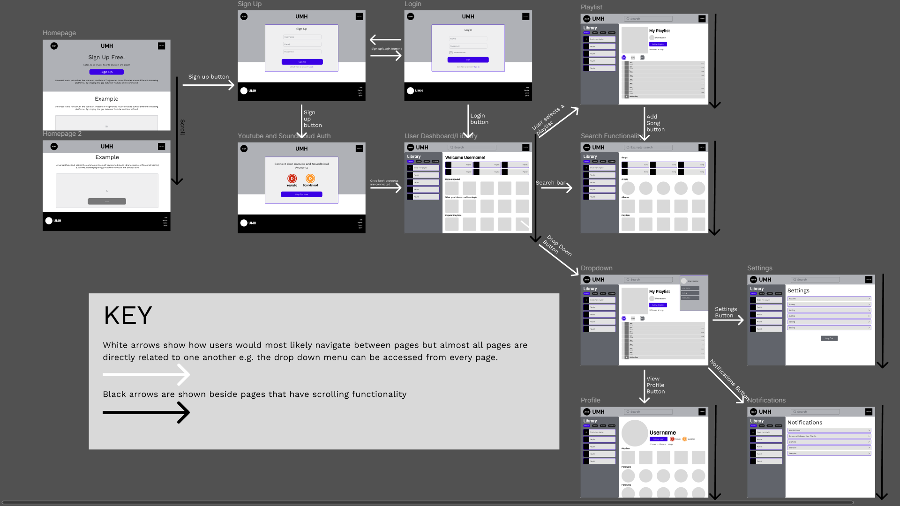
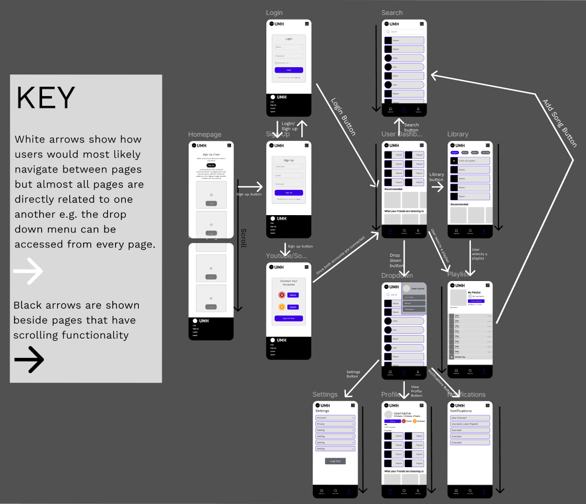

# Universal Music Hub - Cross-Platform Music Integration

## Purpose
Universal Music Hub solves the common problem of fragmented music libraries across different streaming platforms. By bridging the gap between Youtube and SoundCloud, it enables users to:
- Access their entire music collection in one place
- Create unified playlists combining tracks from multiple platforms
- Seamlessly switch between different music services
- Maintain a consistent listening experience across platforms

## Core Functionality & Features

### 1. Account Integration
- Secure authentication with Youtube and SoundCloud accounts
- Automatic playlist import from connected services
- Synchronized "Likes" and favorite tracks across platforms

### 2. Playlist Management
- Create cross-platform playlists
- Import existing playlists from connected services
- Real-time playlist synchronization
- Collaborative playlist creation
- Smart playlist features (automated playlists based on listening habits)

### 3. Playback Controls
- Universal queue system
- Seamless playback switching between platforms
- Shuffle and repeat options
- Continuous playback across platform switches

### 4. Search & Discovery
- Unified search across all connected platforms
- Advanced filtering options
- Genre-based browsing

### 5. User Experience
- Intuitive, modern interface
- Responsive design for all devices
- Dark/light mode options
- Customizable dashboard
- Real-time updates and notifications

### 6. Social Features
- Profile creation and customization
- Follow other users
- Share playlists and tracks

## Target Audience

### Primary Audience
1. Music Enthusiasts
   - Active music listeners who use multiple streaming services
   - Playlist creators and curators
   - Users with diverse music tastes spanning mainstream and independent artists

2. Content Creators
   - DJs looking to access tracks from multiple platforms
   - Podcast producers
   - Social media content creators

3. Young Tech-Savvy Users
   - Age range: 16-35
   - Comfortable with technology
   - Active social media users
   - Early adopters of new music platforms

### Secondary Audience
1. Casual Music Listeners
   - Users who occasionally switch between platforms
   - People who share music with friends across different services

2. Music Industry Professionals
   - Artists and producers
   - Music bloggers and journalists
   - Event organizers

## Technical Stack

### Frontend
- **Framework**: React.js
- **State Management**: Redux
- **Styling**: 
  - CSS
  - Styled Components
- **UI Components**: Material-UI

### Backend
- **Runtime**: Node.js
- **Framework**: Express.js
- **API**: Mongoose with Render server
- **Authentication**: JWT

### Database
- **Primary Database**: Mongoose Atlas

### Testing & Quality Assurance
- **Unit Testing**: Jest
- **API Testing**: Bruno

### Development Tools
- **Version Control**: Git
- **CI/CD**: GitHub Actions
- **Code Quality**: ESLint, Prettier
- **API Documentation**: Swagger

### Third-Party Integrations
- Youtube Web API
- SoundCloud API
- OAuth providers

# Dataflow Diagram

# Application Architecture Diagram

# Wireframes
## Desktop

## Individual Desktop Wireframes

   
Homepage Before Sign Up 

   
   
   
Sign Up Page

   
   
Youtube and SoundCloud Auth Page

   
   
Login Page

   
   
User Dashboard and Library

   
   
Search Page Example

   
   
Playlist Page

   
   
Drop Down Menu Example

   
   
Settings Page

   
   
User Profile Page

   
   
Notifications Page

   

## Mobile

## Individual Mobile Wireframes

   
Homepage Before Sign Up 

   
   
   
Sign Up Page

   
   
Youtube and SoundCloud Auth Page

   
   
Login Page

   
   
User Dashboard

   
   
Library

   
   
Search Page Example

   
   
Playlist Page

   
   
Drop Down Menu Example

   
   
Settings Page

   
   
User Profile Page

   
   
Notifications Page

   

# User Stories and Refinements

## High Priority Stories

### Authentication & Account Management

**Initial Story:**
As a music listener, I want to connect my Youtube and SoundCloud accounts so that I can access all my music in one place.

**Refined Stories:**
1. As a new user, I want to connect my Youtube account using OAuth so that I can quickly start accessing my Youtube library.
   - Acceptance Criteria:
     - One-click Youtube OAuth connection
     - Clear error messaging if connection fails
     - Successful connection confirmation
     - Option to disconnect account

2. As a new user, I want to connect my SoundCloud account using OAuth so that I can access my SoundCloud tracks.
   - Acceptance Criteria:
     - One-click SoundCloud OAuth connection
     - Clear error handling
     - Connection status indicator
     - Account disconnection option

3. As a returning user, I want my login sessions to persist so that I don't have to reconnect my accounts every time.
   - Acceptance Criteria:
     - Remember me option
     - Secure token storage
     - Automatic token refresh
     - Clear session expiration handling

### Playlist Management

**Initial Story:**
As a playlist creator, I want to make playlists that combine songs from both platforms so that I can organize all my music together.

**Refined Stories:**
1. As a playlist curator, I want to create a new playlist and add songs from either platform so that I can organize my cross-platform music collection.
   - Acceptance Criteria:
     - Create playlist with name and description
     - Add songs from search results

2. As a music enthusiast, I want my existing Youtube and SoundCloud playlists to automatically import so that I don't lose my current music organization.
   - Acceptance Criteria:
     - Automatic playlist detection
     - Import progress indicator
     - Handling of duplicate songs
     - Option to select specific playlists to import

### Playback Experience

**Initial Story:**
As a listener, I want to play songs from either platform seamlessly so that I don't notice which service the song is from.

**Refined Stories:**
1. As an active listener, I want smooth transitions between Youtube and SoundCloud tracks so that my listening experience isn't interrupted.
   - Acceptance Criteria:
     - Gapless playback
     - Pre-loading next track
     - Handling platform API limits

2. As a mobile user, I want background playback support so that I can listen while using other apps.
   - Acceptance Criteria:
     - Background audio playback
     - Media notification controls
     - Handle interruptions (calls, etc.)

## Medium Priority Stories

### Search & Discovery

**Initial Story:**
As a user, I want to search for songs across both platforms so that I can find all available versions.

**Refined Stories:**
1. As a music discoverer, I want unified search results from both platforms so that I can compare versions and availability.
   - Acceptance Criteria:
     - Real-time search suggestions
     - Filtering by platform
     - Sort by relevance/popularity

2. As a playlist builder, I want to see detailed track information so that I can choose the best version for my playlist.
   - Acceptance Criteria:
     - Display audio quality
     - Show platform source
     - Include artist details

### Social Features

**Initial Story:**
As a social user, I want to share my playlists with friends so that we can enjoy music together.

**Refined Stories:**
1. As a social music fan, I want to share my cross-platform playlists so that friends can access them regardless of their preferred platform.
   - Acceptance Criteria:
     - Generate shareable links
     - Platform-specific sharing options
     - Privacy controls
     - Follow/unfollow playlists

2. As a playlist discoverer, I want to browse popular public playlists so that I can find new music.
   - Acceptance Criteria:
     - Sort by popularity/recent
     - Preview playlist contents
     - One-click follow

## Low Priority Stories

### Profile Customization

**Initial Story:**
As a user, I want to customize my profile so that I can express my music taste.

**Refined Stories:**
1. As a profile owner, I want to customize my profile with my favorite music so that others can discover my taste.
   - Acceptance Criteria:
     - Upload profile picture
     - Add bio
     - Pin favourite playlists

## Story Refinement Process

Stories were refined based on:
1. Technical feasibility analysis
2. User feedback sessions
3. Platform API limitations
4. Performance considerations
5. Security requirements

Each refinement iteration focused on:
- Breaking down large stories into manageable pieces
- Adding specific acceptance criteria
- Considering edge cases
- Addressing technical constraints
- Incorporating user feedback
- Aligning with business goals
- Caching strategies
- CDN integration
- Database optimization

# Trello Screenshots

Initial Setup

Day 1

Day 2

Wireframes Completed

